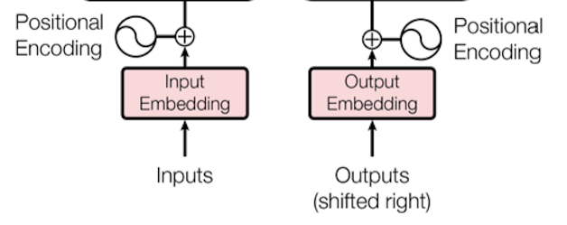
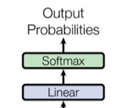
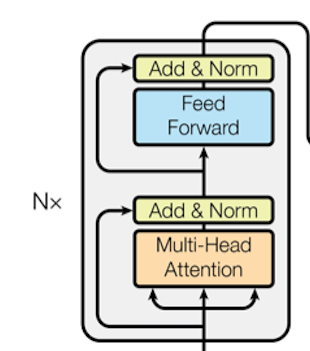
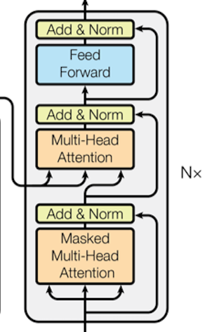

## Transformer的优势
- 能够利用分布式GPU并行训练，提升模型训练效率
- 在分析预测更长的文本时，捕捉较长的语义关联效果更好
## Transformer的作用
- 基于seq2seq架构的transformer模型可以完成NLP领域的典型任务，如机器翻译，文本生成等。
- 也可以构建与训练语言模型，用于不同任务的迁移学习
## Transfomer结构原理图

 

- 输入部分
    - 原文本嵌入层，位置编码器
    - 目标文本嵌入层，位置编码器
      
    

- 输出部分
    - 线性层
    - softmax层
      
    

- 编码器部分
    - 由N个Encoder堆叠
    - 每个encoder有两个子结构组成
    - 第一个子结构包括一个多头自注意力、规范化层、残差连接
    - 第二个子结构包括一个前馈全连接、规范化层、残差连接
      
    

- 解码器部分
    - 由N个decoder堆叠
    - 每个decoder有三个子结构组成
    - 第一个子结构包括一个掩码多头自注意力、规范化层、残差连接
    - 第二个子结构包括一个多头注意力、规范化层、残差连接
    - 第三个字结构包括一个前馈全连接层、规范化层、残差连接
      
    

 

